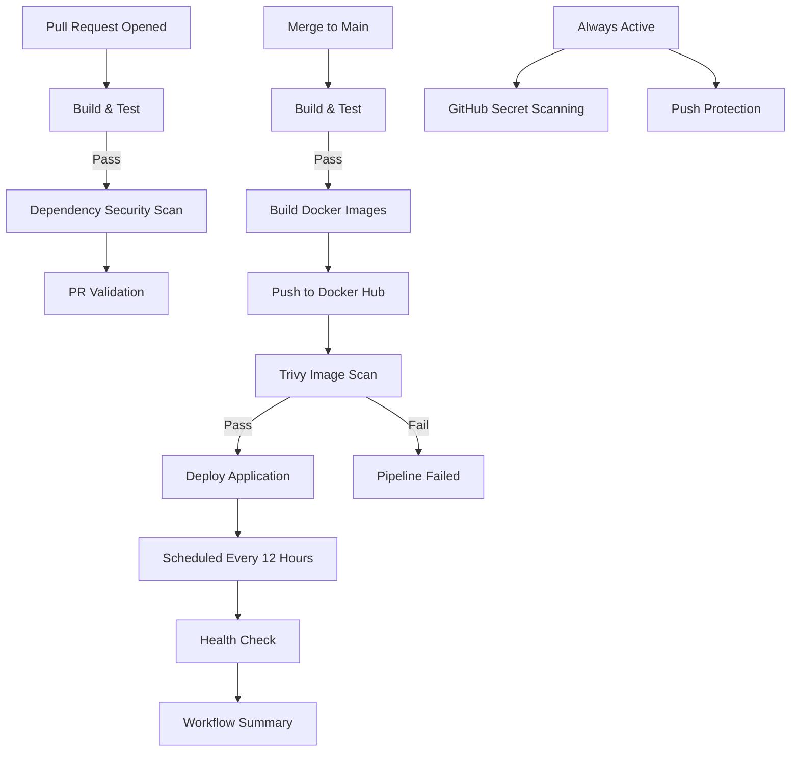

# DevBoard

This repository contains **DevBoard**, a production-style three-tier application built as part of the GitHub Actions CI/CD project. It demonstrates a complete DevOps workflow using GitHub Actions, Docker, PostgreSQL, automated testing, security scanning, and deployment.

## Three-Tier Architecture

The repository contains a full-stack three-tier application:

- **Frontend**: React + Vite application providing the user interface.
- **Backend**: Go (Gin) REST API serving application data and business logic.
- **Database**: PostgreSQL database storing tasks and application data.

### API Endpoints

- `/health` – Health check endpoint used by GitHub Actions to verify application availability.
- `/api/tasks` – Retrieve all tasks.
- `/api/tasks/:id` – Retrieve a specific task.
- `/api/tasks` *(POST)* – Create a new task.
- `/api/tasks/:id` *(PUT)* – Update an existing task.
- `/api/tasks/:id` *(DELETE)* – Delete a task.

## Getting Started

### Prerequisites

- Docker
- Docker Compose
- Git

### Run the Application

1. Clone the repository.
2. Navigate to the project directory.
3. Create the required environment variables.
4. Start the application:

```bash
docker compose up --build
```

The application will start all three services:

- Frontend
- Backend
- PostgreSQL Database

## CI/CD Pipeline Features

- Pull Request Pipeline
  - Build & Test
  - Dependency Security Scan
  - PR Validation

- Main Pipeline
  - Build & Test
  - Docker Image Build
  - Push Images to Docker Hub
  - Trivy Image Vulnerability Scan
  - Deployment

- Scheduled Health Check
  - Runs every 12 hours
  - Verifies application health
  - Generates workflow summary

- GitHub Secret Scanning
  - Push Protection
  - Secret Detection

## Badges


```md
[](https://github.com/Mujakkir-Pathan/github-actions-capstone/actions/workflows/main-pipeline.yml)

[](https://github.com/Mujakkir-Pathan/github-actions-capstone/actions/workflows/health-check.yml)

[](https://github.com/Mujakkir-Pathan/github-actions-capstone/actions/workflows/pr-pipeline.yml)
```

## Pipeline Architecture Diagram



## Technology Stack

- React
- Vite
- Go
- Gin
- PostgreSQL
- Docker
- Docker Compose
- GitHub Actions
- Trivy
- Gitleaks

## Project Structure

```
devboard/
├── frontend/
├── backend/
├── init/
│   └── postgres/
├── .github/
│   └── workflows/
├── docker-compose.yml
└── README.md
```

## Future Improvements

- Add Slack notifications
- Deploy to Kubernetes
- Infrastructure as Code using Terraform
- Monitoring with Prometheus & Grafana
- Automated rollback on deployment failure
- Container image signing